# Звіт: Налаштування Secure SDLC Pipeline для juice-shop

## Мета
Інтеграція інструментів безпекового аналізу (Gitleaks, Hadolint, Trivy, Dockle) у GitHub Actions для побудови повного Secure SDLC Pipeline вебзастосунку juice-shop.

---

## Крок 1: Підготовка репозиторію
Створено власний репозиторій `juice-shop-github-actions.Lab5` на основі форку проєкту juice-shop. Репозиторій відв'язано від оригіналу (Unlink fork). У папці `.github/workflows/` вже містились файли попередніх робіт: `snyk.yml`, `sonar_SAST.yml`, `zap_DAST.yml`.

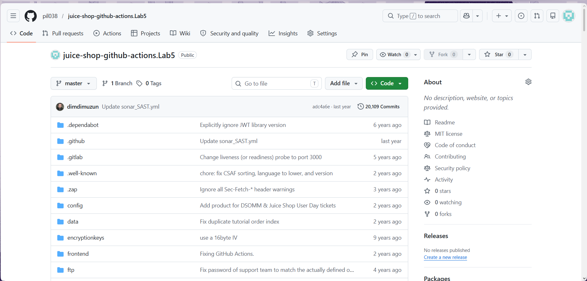

---

## Крок 2: Створення workflow-файлу
Прямо через інтерфейс GitHub у папці `.github/workflows/` створено новий файл `secure-sdlc-pipeline.yml` з конфігурацією Advanced Secure SDLC Pipeline, що включає 6 етапів: Gitleaks, Hadolint, Docker build, Trivy, Dockle, Upload artifact. Після коміту автоматично запустились усі наявні workflows у репозиторії.

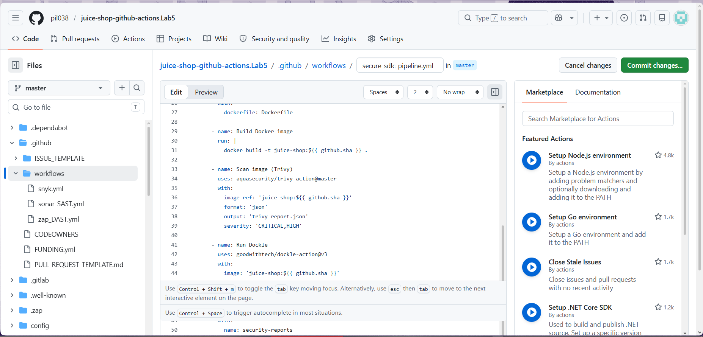
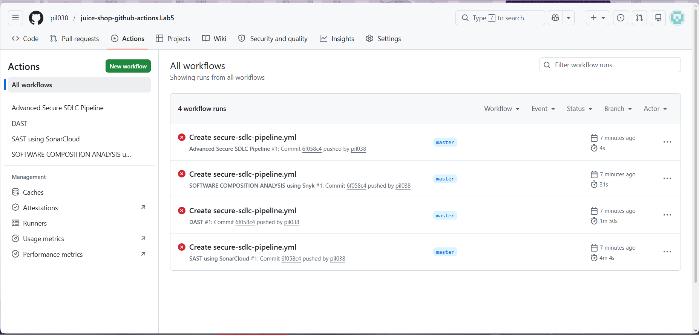

---

## Крок 3: Перший запуск — помилка Dockle
Pipeline #1 завершився з Failure за 4 секунди. В Annotations виявлено причину:
```
Unable to resolve action `goodwithtech/dockle-action@v3`, unable to find version `v3`
```
Версія `v3` для Dockle action не існує у GitHub Marketplace. Pipeline навіть не дійшов до запуску кроків — впав на етапі ініціалізації.

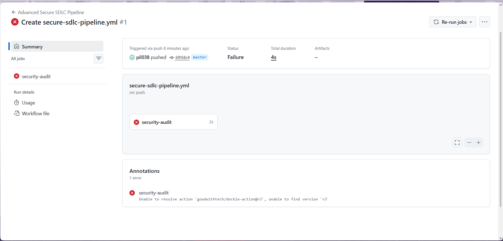
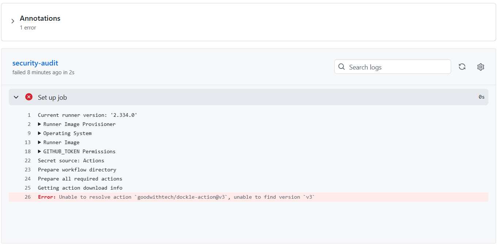

---

## Крок 4: Виправлення версії Dockle — Pipeline #2
Виправлено версію Dockle action з `@v3` на `@v0.1.2`. Pipeline #2 пройшов далі та завершився за 26 секунд. Gitleaks відпрацював успішно: **No leaks detected**. Проте Hadolint виявив 10 помилок типу `DL3059` (Multiple consecutive RUN instructions) у Dockerfile juice-shop. Збережено перший артефакт: `gitleaks-results.sarif`.

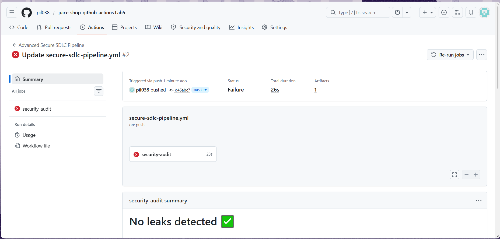
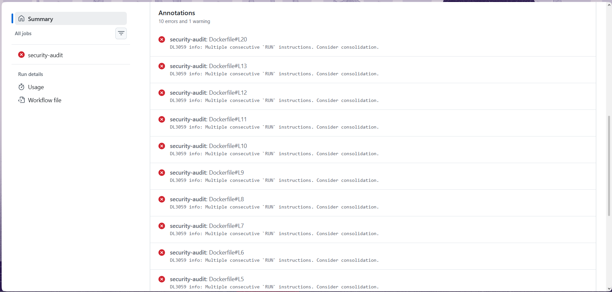
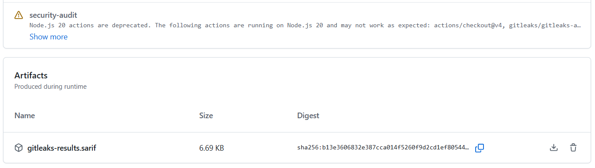

---

## Крок 5: Виправлення Hadolint — Pipeline #3
Додано параметр `failure-threshold: error` до кроку Hadolint. Pipeline #3 завершився за 20 секунд. Hadolint тепер показав нові 4 попередження: `DL3006`, `DL3003`, `DL3015`, `DL3008` — інші типові проблеми Dockerfile juice-shop. Всі є очікуваними для навмисно вразливого застосунку.

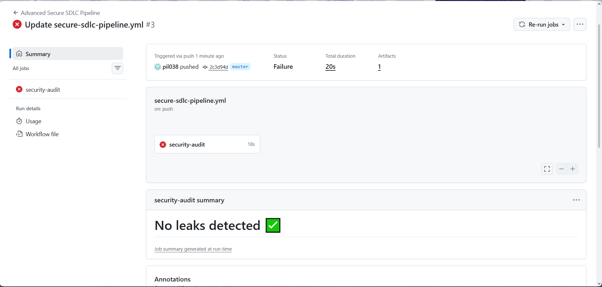
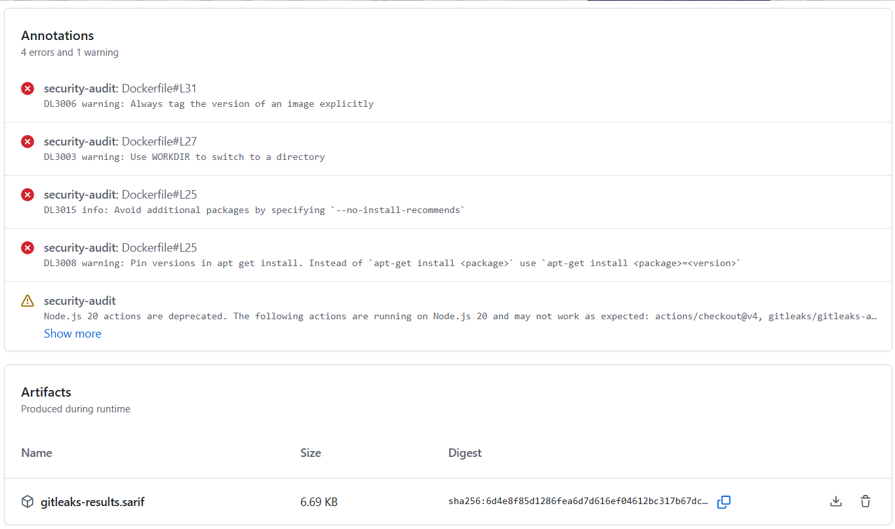

---

## Крок 6: Додавання continue-on-error — Pipeline #4
Додано `continue-on-error: true` до кроку Hadolint. Pipeline #4 завершився за 25 секунд — DL3059 повернувся знову. З'ясовано, що Hadolint action ігнорує `failure-threshold` для інформаційних повідомлень типу `info`.

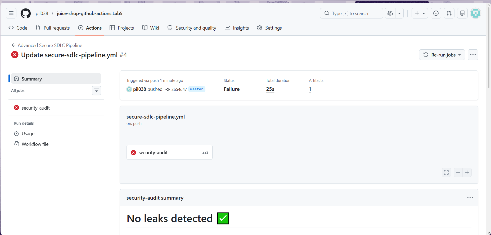
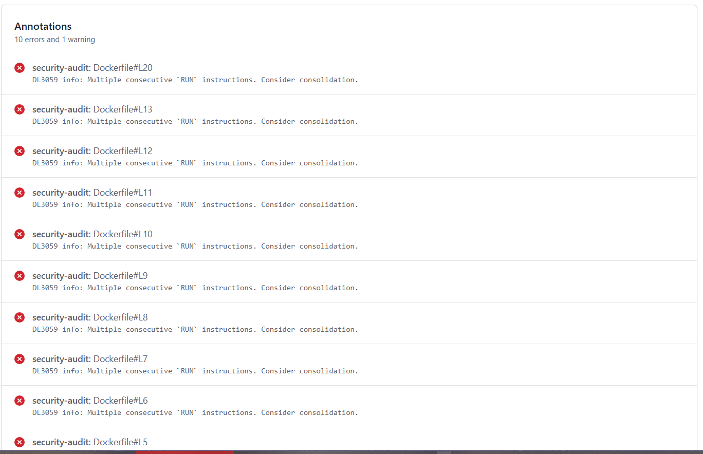

---

## Крок 7: Вирішення проблеми Docker build
У наступних запусках (#5, #6) виявлено ще одну проблему: Docker build завершувався з помилкою через застарілий базовий образ `node:20-buster` (Debian Buster EOL — репозиторії недоступні). Trivy не міг знайти образ для сканування.

Для вирішення крок `Build Docker image` замінено на завантаження офіційного образу juice-shop з Docker Hub:
```yaml
- name: Pull Docker image
  run: |
    docker pull bkimminich/juice-shop:latest
    docker tag bkimminich/juice-shop:latest juice-shop:${{ github.sha }}
```

---

## Крок 8: Фінальна версія workflow
Фінальний файл `.github/workflows/secure-sdlc-pipeline.yml`:

```yaml
name: Advanced Secure SDLC Pipeline

on:
  push:
    branches: [ "main", "master" ]
  pull_request:
    branches: [ "main", "master" ]

jobs:
  security-audit:
    runs-on: ubuntu-latest
    
    steps:
      - name: Checkout code
        uses: actions/checkout@v4
        with:
          fetch-depth: 0

      - name: Check for secrets (Gitleaks)
        uses: gitleaks/gitleaks-action@v2
        env:
          GITHUB_TOKEN: ${{ secrets.GITHUB_TOKEN }}

      - name: Lint Dockerfile (Hadolint)
        uses: hadolint/hadolint-action@v3.1.0
        continue-on-error: true
        with:
          dockerfile: Dockerfile

      - name: Pull Docker image
        run: |
          docker pull bkimminich/juice-shop:latest
          docker tag bkimminich/juice-shop:latest juice-shop:${{ github.sha }}

      - name: Scan image (Trivy)
        uses: aquasecurity/trivy-action@master
        with:
          image-ref: 'juice-shop:${{ github.sha }}'
          format: 'json'
          output: 'trivy-report.json'
          severity: 'CRITICAL,HIGH'
          exit-code: '0'

      - name: Run Dockle
        uses: goodwithtech/dockle-action@v0.1.2
        continue-on-error: true
        with:
          image: 'juice-shop:${{ github.sha }}'
          format: list

      - name: Upload Security Report
        uses: actions/upload-artifact@v4
        with:
          name: security-reports
          path: trivy-report.json
```

---

## Крок 9: Успішний запуск Pipeline #7
Після всіх виправлень Pipeline #7 завершився зі статусом **Success** за 43 секунди. Артефакти: **2**. Gitleaks підтвердив: **No leaks detected**. Annotations з DL3059 присутні як інформаційні попередження, але більше не блокують виконання pipeline.

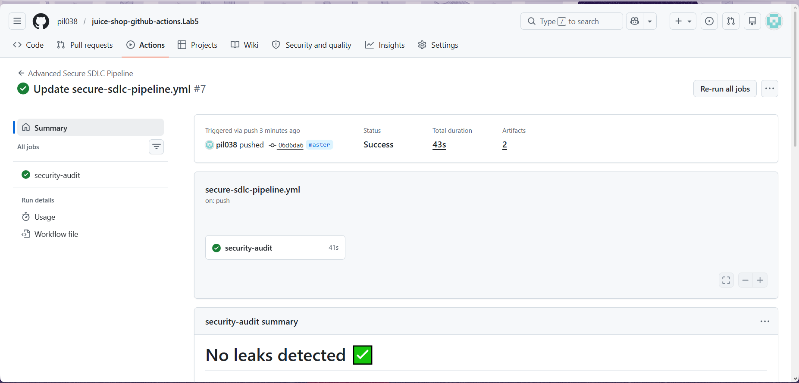
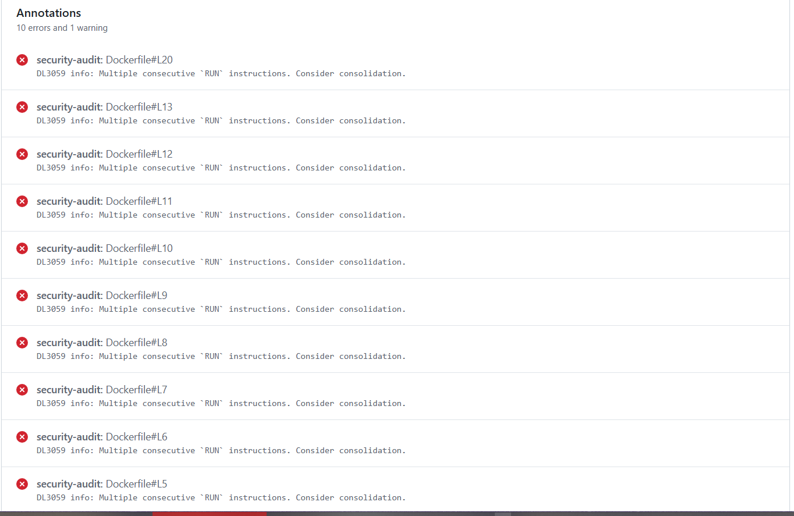

---

## Крок 10: Збережені артефакти зі звітами
У розділі Artifacts доступні два артефакти:
- `gitleaks-results.sarif` (6.69 KB) — результати сканування секретів Gitleaks
- `security-reports` (65.5 KB) — JSON-звіт Trivy з CVE-вразливостями образу

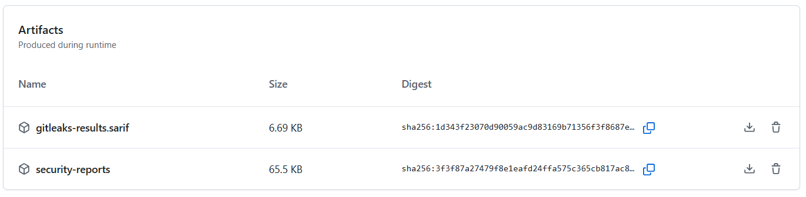

---

## Висновок
Успішно налаштовано GitHub Actions Workflow для інтеграції повного Secure SDLC Pipeline:
- Workflow автоматично запускається при кожному push або PR до гілки `master`
- **Gitleaks** просканував усю історію комітів (`fetch-depth: 0`) — секретів не виявлено
- **Hadolint** виявив типові проблеми Dockerfile juice-shop (застарілі практики), які є очікуваними для навмисно вразливого застосунку
- **Trivy** просканував офіційний образ `bkimminich/juice-shop:latest` на CVE-вразливості рівня CRITICAL та HIGH, результат збережено у форматі JSON
- **Dockle** проаналізував структуру образу на відповідність best practices
- Звіт Trivy збережено як GitHub Actions Artifact (`security-reports`, 65.5 KB)

Основні труднощі були пов'язані з відсутністю актуальної версії Dockle action (`v3` не існує) та застарілим Dockerfile juice-shop (Debian Buster EOL) — вирішено виправленням версії на `v0.1.2` та використанням офіційного публічного образу з Docker Hub замість локальної збірки.
